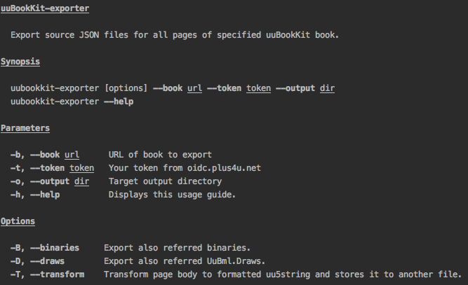

This tool exports JSON files for all pages, referred Binaries and UuBml.Draws of specified book into the specified directory.

[Changelog](doc/CHANGELOG.md)

# How to install ?

`npm install --registry "https://repo.plus4u.net/repository/npm/" -g uubookkit-exporter`

# How to use ?

# How to develop ?

Publish to npmjs: 

`npm publish --registry http://registry.npmjs.com`
